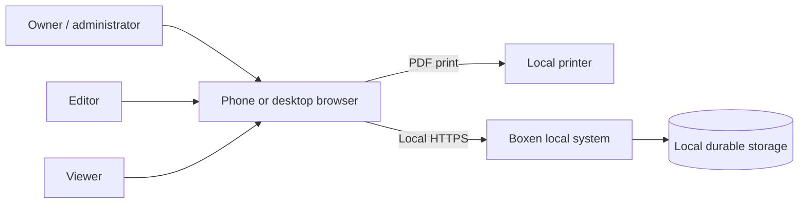

# Boxen System Design

**Document status:** Proposed build baseline  
**Design version:** 1.0  
**Updated:** 2026-09-20  
**Scope:** Single-node, locally hosted Boxen v1

**Current scope correction:** [ADR-0005](docs/system-design/adrs/0005-small-local-app-and-anonymous-access.md) supersedes the account-required default and large-capacity qualification gates below: this is a small local app with configurable anonymous access, not a capacity-testing project.

**Photo collection clarification:** [ADR-0006](docs/system-design/adrs/0006-photo-collection-inventory.md) defines photos as views representing one box's contents, including staged items and close-ups without a visible container. Independent photo analysis feeds shared inventory review; repeated views must not silently increase quantities.

**Photo storage:** [ADR-0012](docs/system-design/adrs/0012-normalized-photo-storage.md) supersedes raw upload retention for new photos: store WebP at quality 85 with a maximum 2,048-pixel edge. Existing originals remain unchanged; backups preserve each photo's stored bytes.

**Review interface:** [ADR-0007](docs/system-design/adrs/0007-chip-set-review.md) replaces per-suggestion action cards with removable item chips, an add-item field and one atomic acceptance of the edited set. Quantity and source details remain available on demand.

**Box organization:** [ADR-0008](docs/system-design/adrs/0008-tags-and-collections.md) adds reusable tags and overlapping named collections, with filterable itemization that retains each item's source box and quantity.

**Contextual search:** [ADR-0009](docs/system-design/adrs/0009-contextual-search-suggestions.md) adds local typeahead: meaningful `BX-` prefixes suggest boxes; ordinary text suggests confirmed contents, tags and collections. Submitted full-text search remains unchanged.

**Authentication and administration:** [ADR-0011](docs/system-design/adrs/0011-authentication-store-and-core-admin.md)
adds optional OIDC sign-in, explicit subject bindings, a protected local core
administrator, salted and peppered passwords, session/audit administration and
public local help. Local sign-in and core inventory remain usable offline;
explicitly configured OIDC requires its provider's network connection.

## Purpose

**Container deployment:** [ADR-0010](docs/system-design/adrs/0010-container-deployment-and-ai-boundary.md)
defines the image/volume layout and separate inference execution. Local/offline
remains the default; an explicitly enabled remote vision server is an optional
exception to the same-host runtime guarantee, not a fallback.

This is the authoritative entry point for Boxen. The linked specifications define the system closely enough that implementation can proceed without inventing domain rules, interfaces, states, storage behavior, UI behavior, or verification criteria.

The words **MUST**, **MUST NOT**, **SHOULD**, **SHOULD NOT**, and **MAY** are normative. Machine-readable contracts take precedence over prose for field names and wire formats. Prose takes precedence when a machine-readable format cannot express a behavioral invariant.

## Product statement

Boxen is a private, self-hosted web application for recording physical storage boxes and their contents. It stores structured state in SQLite, associates local images with boxes, uses a locally hosted vision-language model to propose inventory items, renders user descriptions as safe Markdown, searches names/descriptions/items, prints QR labels, and retrieves a box through live scanning, QR-image upload, or typed code.

Once installed and provisioned, core inventory and local sign-in MUST function
without internet access. Explicitly enabled remote AI and OIDC have the external
dependencies described in ADR-0010 and ADR-0011.

## Authoritative specification set

| Area | Specification | Normative artifacts |
| --- | --- | --- |
| Product scope and quality attributes | [Product and requirements](docs/system-design/00-product-and-requirements.md) | Requirement IDs and acceptance measures |
| Platform, topology, and component boundaries | [Platform and architecture](docs/system-design/01-platform-and-architecture.md) | C4-style views, process/port/filesystem contracts |
| Domain language, aggregates, invariants, and events | [Domain-driven design](docs/system-design/02-domain-driven-design.md) | Aggregate and state-machine rules |
| Relational, media, search, and transaction model | [Data and storage](docs/system-design/03-data-and-storage.md) | [SQLite reference DDL](docs/system-design/contracts/schema.sql) |
| HTTP conventions, endpoints, payloads, and failures | [API specification](docs/system-design/04-api-specification.md) | [OpenAPI 3.1.2](docs/system-design/contracts/openapi.yaml) |
| Information architecture, cyberpunk visual system, screens, and states | [UI/UX specification](docs/system-design/05-ui-ux-specification.md) | [CSS design tokens](docs/system-design/contracts/ui-tokens.css) |
| QR payload, physical labels, camera and QR-image decoding | [Label and scanning specification](docs/system-design/12-label-and-scanning.md) | Label profiles and scan-state contract |
| Local model boundary, prompts, review flow, and evaluation | [AI subsystem](docs/system-design/06-ai-subsystem.md) | [AI output JSON Schema](docs/system-design/contracts/ai-inventory-output.schema.json) |
| Trust boundaries, threats, privacy, and controls | [Security and privacy](docs/system-design/07-security-and-privacy.md) | Security acceptance gates |
| Installation, TLS, backup, migration, monitoring, and recovery | [Operations and deployment](docs/system-design/08-operations-and-deployment.md) | Runtime layout and runbooks |
| Test layers, fixtures, matrices, performance, AI, security, and release gates | [Test and quality plan](docs/system-design/09-test-and-quality-plan.md) | Test IDs and release evidence |
| Sequenced delivery and work packages | [Delivery plan](docs/system-design/10-delivery-plan.md) | Phase entry/exit gates |
| Requirement-to-design-to-test mapping | [Traceability](docs/system-design/11-traceability.md) | Complete FR/NFR coverage matrix |

## Architecture decision records

- [ADR-0001: Single-node modular monolith](docs/system-design/adrs/0001-modular-monolith.md)
- [ADR-0002: SQLite plus managed local media](docs/system-design/adrs/0002-sqlite-and-media.md)
- [ADR-0003: Human-reviewed local AI](docs/system-design/adrs/0003-human-reviewed-local-ai.md)
- [ADR-0004: Host-independent QR payload](docs/system-design/adrs/0004-host-independent-qr.md)
- [ADR-0005: Small local deployment and anonymous access](docs/system-design/adrs/0005-small-local-app-and-anonymous-access.md)
- [ADR-0006: Collective photo evidence](docs/system-design/adrs/0006-photo-collection-inventory.md)
- [ADR-0007: Editable chip-set review](docs/system-design/adrs/0007-chip-set-review.md)
- [ADR-0008: Tags and collections](docs/system-design/adrs/0008-tags-and-collections.md)
- [ADR-0009: Contextual search suggestions](docs/system-design/adrs/0009-contextual-search-suggestions.md)
- [ADR-0010: Container deployment and AI execution boundary](docs/system-design/adrs/0010-container-deployment-and-ai-boundary.md)
- [ADR-0011: Authentication store and protected core administrator](docs/system-design/adrs/0011-authentication-store-and-core-admin.md)
- [ADR-0012: Normalize new photo uploads](docs/system-design/adrs/0012-normalized-photo-storage.md)

## Fixed v1 decisions

1. **Architecture:** one deployable application codebase, one web process, one worker process, one loopback-only AI runtime, and a local TLS proxy for production/live-camera access. Per ADR-0005, explicit trusted-LAN development HTTP also supports ordinary inventory and uploaded/typed QR workflows without the TLS proxy; it does not provide encryption or live browser camera access.
2. **Authority:** SQLite and the managed media tree are authoritative; search is a rebuildable projection; model output is never authoritative until a user accepts it.
3. **Consistency:** catalog and inventory changes are ACID transactions. Search has read-after-write consistency for successful user mutations. AI work is asynchronous and at-least-once with idempotent completion.
4. **Public identity:** users and labels address boxes by immutable `BoxCode`, never database row IDs.
5. **QR data:** `boxen:v1:<BoxCode>` is the canonical label payload. It has no hostname and remains valid if the host or address changes.
6. **Connectivity:** the browser talks only to the local Boxen origin. Application containers have no required internet egress. The AI process is not published to the LAN.
7. **AI safety:** AI creates observations in a review queue. Accepting an observation creates or updates a confirmed inventory item; re-analysis never overwrites user edits.
8. **UI direction:** a restrained industrial-cyberpunk design is normative, but legibility, WCAG 2.2 AA, reduced motion, and mobile usability override decoration.
9. **API:** same-origin `/api/v1`, cookie session authentication, CSRF protection, optimistic concurrency via ETags, and RFC 9457 problem responses.
10. **Versioning:** schemas, prompts, model artifacts, migrations, API, and backup manifests are explicitly versioned and never inferred from application binaries alone.

## Capacity envelope

The v1 design MUST support the following reference installation without architectural change:

- 10,000 active or archived boxes;
- 100,000 confirmed inventory items;
- 50,000 original images and their derivatives;
- 10 concurrent browser sessions;
- one active AI inference job per configured worker slot;
- one local host with local, non-networked persistent storage.

These are design-test ceilings, not recommended household targets.

## System context

No external actor or service is required at runtime.

## Delivery state

This repository currently contains a design baseline only. No application, migration, model bundle, container image, security control, or test suite should be represented as implemented until corresponding source and passing verification evidence exist.

## Standards baseline

- [OpenAPI 3.1.2](https://spec.openapis.org/oas/v3.1.2.html)
- [JSON Schema 2020-12](https://json-schema.org/draft/2020-12)
- [RFC 9457 Problem Details](https://datatracker.ietf.org/doc/html/rfc9457)
- [WCAG 2.2](https://www.w3.org/TR/WCAG22/)
- [SQLite FTS5](https://www.sqlite.org/fts5.html) and [WAL](https://www.sqlite.org/wal.html)
- [OWASP ASVS 5.0](https://owasp.org/projects/asvs)
- [RFC 9106 Argon2](https://datatracker.ietf.org/doc/html/rfc9106)
