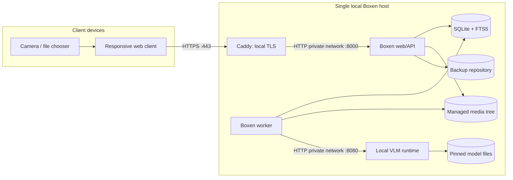
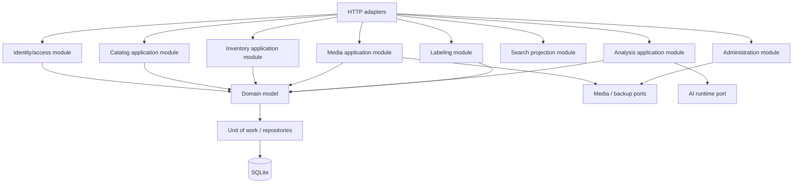
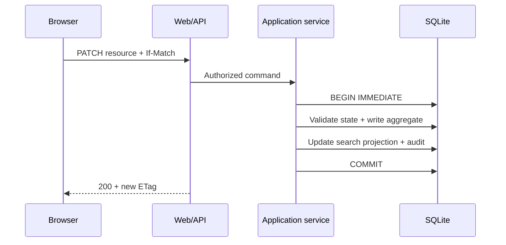
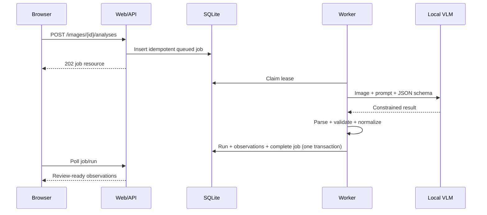

# Platform and Architecture

## 1. Architecture style

Boxen v1 is a **single-node modular monolith** with process separation for latency and fault isolation:

- one codebase and one authoritative relational schema;
- one web/API process;
- one durable background worker process using the same domain/application packages;
- one local multimodal inference sidecar behind an adapter;
- one local TLS reverse proxy for supported LAN/mobile use (omissible only in loopback development or replaceable by a contract-compatible local terminator);
- one local SQLite database and one managed media tree.

There is no distributed message broker, service mesh, external object store, cloud identity system, or runtime internet dependency.

## 2. Reference platform

### Production support

| Layer | Reference | Contract |
| --- | --- | --- |
| Host OS | 64-bit Linux with systemd or Docker Compose | Primary supported production platform |
| CPU | x86-64 with AVX2 or ARM64 with NEON | Four logical cores minimum |
| RAM | 16 GiB recommended; 8 GiB application-only minimum | AI profile declares its additional requirement |
| GPU | Optional | Model profile records backend and VRAM requirement |
| Storage | Local SSD, 20 GiB free plus user images/backups | Network filesystems are unsupported |
| Browser access | Local IPv4/IPv6 LAN over HTTPS | Internet exposure is unsupported |
| Container runtime | OCI-compatible engine with Compose support | Images pinned by digest for release |

macOS and Windows are supported development/desktop-host environments through the production container bundle, subject to camera/TLS device testing. Native packaging for those systems is not a v1 release requirement.

### Reference capacity hardware

Performance acceptance uses a machine with at least 4 modern CPU cores, 16 GiB RAM, and an SSD. AI performance is reported separately for CPU-only and configured accelerator profiles; AI latency is never included in ordinary request SLOs.

## 3. Technology baseline

| Concern | Selected technology | Rationale |
| --- | --- | --- |
| Web/API | CPython 3.13 + FastAPI + Pydantic v2 + Uvicorn | Typed HTTP boundary and direct access to local AI/image ecosystem |
| Domain/data access | Plain domain classes + SQLAlchemy 2 + Alembic | Domain isolation with explicit synchronous unit-of-work and forward migrations |
| Frontend | React 19 + strict TypeScript + Vite; Node.js 24 LTS at build/test time only | Stateful scanner/review UX compiled to static production assets; no Node.js production process |
| Styling | Project CSS and normative design tokens | No runtime framework or CDN dependency |
| Structured data | SQLite with foreign keys and WAL | Single-host durability, transactions, FTS5, simple operations |
| Media | Local content-addressed filesystem | Keeps large immutable binaries out of relational pages |
| Search | SQLite FTS5 projection | Local, transactional, rebuildable full-text search |
| Job queue | Lease-based SQLite table | Durable local work without Redis/RabbitMQ |
| AI inference | Adapter over local `llama.cpp` multimodal server | Quantized local models, CPU/GPU options, constrained JSON |
| Markdown | `markdown-it-py` + `nh3` | CommonMark-compatible parsing followed by an explicit HTML allowlist; a separate plain-text projection feeds search |
| Images | Pillow with only release-enabled decoders | Validation, orientation, dimensions, metadata stripping, and derivatives |
| QR generation | Segno `make_qr` with Micro QR disabled | Deterministic standards-compliant SVG/raster symbols |
| Label PDF | ReportLab `pdfgen` with bundled embedded fonts | Stable physical dimensions without browser print variance |
| QR decode | Bundled `@zxing/browser` in a Web Worker; native `BarcodeDetector` only as an optional acceleration path | Works locally across target browsers with one canonical parser |
| TLS proxy | Caddy internal CA profile | Local HTTPS for phone camera access |
| Password hashing | `argon2-cffi` high-level `PasswordHasher`, Argon2id | Memory-hard local credential storage with encoded parameters and rehash detection |

Release lockfiles and image digests are authoritative for exact versions. No dependency uses a floating `latest` reference.

### Normative package profile

The package choices below are part of the v1 architecture, not examples. A substitution requires an ADR plus the listed contract, security, offline, and fixture tests. Patch/minor versions are pinned by the release lockfiles and may advance through the dependency-update process without an ADR when compatibility tests pass.

| Area | Required package/profile | Important integration rule |
| --- | --- | --- |
| HTTP server | FastAPI/Pydantic v2 on Uvicorn workers | One web process in v1; request bodies use strict models and reject unknown fields |
| Persistence | SQLAlchemy 2 synchronous engine, Alembic, stdlib `sqlite3` capabilities | No async ORM, implicit autocommit, or schema creation at application startup |
| Frontend routing/data | React Router, TanStack Query | Server state stays in the query cache; route params and query state are URL-addressable |
| Forms | React Hook Form plus generated TypeScript API types | Domain validation remains authoritative on the server |
| Markdown | `markdown-it-py` with raw HTML disabled, then `nh3.clean` with Boxen's fixed allowlists | Store source Markdown; cache only renderer-versioned sanitized output; never trust parser output before sanitization |
| Image processing | Pillow | Call `Image.verify`, reopen, enforce decoded limits, transpose orientation, and re-encode derivatives; originals are never executed or transformed in place |
| QR encode | Segno `make_qr(..., error='q', micro=False, boost_error=False)` | The canonical payload and physical geometry in the label specification override library defaults |
| PDF | ReportLab canvas/pdfgen | Draw vector modules and embedded font subsets in exact PDF points; do not use browser HTML-to-PDF |
| QR decode | `@zxing/browser` bundled into a dedicated worker | Pass decoded text to Boxen's parser; the decoder never determines navigation or existence |
| Passwords | `argon2-cffi` `PasswordHasher` configured for Argon2id | Persist the encoded hash, use `check_needs_rehash`, and benchmark the security specification's floor on target hardware |
| Backend verification | pytest, Hypothesis, Ruff, mypy, pip-audit | Architecture/import, property, schema, migration, and security tests run in CI and the offline release build |
| Frontend verification | Vitest, Testing Library, Playwright, axe-core | Component, accessibility, responsive, camera, and end-to-end scenarios use bundled fixtures |
| API verification | OpenAPI parser/linter plus Schemathesis | Every operation has positive, authorization, validation, and problem-response coverage |

The frontend package manager is `pnpm` with a frozen lockfile. Python releases are built from a hash-locked requirements export produced from `pyproject.toml`; runtime images contain installed wheels but no resolver. The standard GIL-enabled CPython build is required for v1.

## 4. Container view



### Network contract

| Port | Exposure | Purpose |
| --- | --- | --- |
| `443/tcp` | Local LAN | Supported application origin |
| `80/tcp` | Local LAN, optional | Redirect to HTTPS only |
| `8000/tcp` | Private container/loopback | Web/API upstream; MUST NOT be LAN-published in production |
| `8080/tcp` | Private container/loopback | AI runtime; MUST NOT be LAN-published |

The deployment MUST remain functional with all outbound traffic denied. Container DNS is required only for private service names.

## 5. Application component view



### Module dependency rule

1. Domain packages import only standard-library types and domain siblings allowed by the context map.
2. Application services depend on domain interfaces and unit-of-work ports.
3. Infrastructure implements repositories, filesystem, model, PDF, clock, checksum, and ID ports.
4. HTTP and worker adapters call application services; they do not issue SQL or filesystem calls directly.
5. Frontend code depends only on the documented HTTP API and static assets.

Automated architecture tests MUST fail forbidden imports.

## 6. Process responsibilities

### `boxen-web`

- Terminates application sessions after proxy TLS.
- Serves compiled versioned frontend assets and `/api/v1`.
- Performs authorization and input validation.
- Runs short application transactions only.
- Streams uploaded images to a staging path, then invokes media finalization.
- Never loads the VLM or performs inference.
- Never performs long backup/restore or derivative repair synchronously.

### `boxen-worker`

- Claims `analysis_jobs` with a renewable lease.
- Generates image derivatives and performs AI analysis.
- Validates AI JSON against the pinned schema.
- Writes immutable analysis runs and observations idempotently.
- Executes owner-requested maintenance jobs such as search rebuild, orphan audit, and backup verification.
- Emits structured local logs and health heartbeats.

### `boxen-ai`

- Loads exactly one configured model profile at startup.
- Accepts requests only from the private application network/loopback.
- Receives local image bytes or allowed media paths; remote URL fetching is disabled.
- Returns schema-constrained JSON or a bounded error.
- Exposes readiness to the worker only.

### `boxen-proxy`

- Provides the sole LAN listener.
- Issues local certificates from a persisted internal CA.
- Redirects HTTP to HTTPS when port 80 is enabled.
- Adds transport security headers and forwards request IDs.
- Does not expose its administration API to the LAN.

## 7. Request and work flows

### Synchronous mutation



### Image analysis



Jobs are at-least-once. A unique operation key and transactional completion make repeated execution safe.

## 8. Filesystem contract

The default container paths are:

```text
/var/lib/boxen/
├── db/boxen.sqlite3
├── media/
│   ├── originals/aa/bb/<sha256>.<ext>
│   ├── display/aa/bb/<sha256>.webp
│   ├── thumbnails/aa/bb/<sha256>.webp
│   └── staging/<random-upload-id>.part
├── models/<profile-id>/...
├── backups/<backup-id>/...
├── tls/...
└── tmp/...
```

- `db`, `media`, `backups`, and `tls` MUST be persistent.
- `models` MUST be persistent and read-only to the AI process during normal runtime.
- `tmp` and `staging` MAY be ephemeral; stale entries are safely swept after database reconciliation.
- The database and media tree MUST be on the same local host. They MAY be separate local volumes.
- Storage keys are relative POSIX-style values in the database; absolute host paths are never stored.

## 9. Configuration contract

Configuration is loaded from one restricted local file plus environment overrides. Unknown keys are fatal. Secrets MUST NOT be accepted on command-line flags.

| Key | Required/default | Meaning |
| --- | --- | --- |
| `BOXEN_ENV` | `production` | `production`, `development`, or `test` |
| `BOXEN_ORIGIN` | required for LAN | Exact HTTPS origin used for CSRF/origin checks |
| `BOXEN_DATA_DIR` | `/var/lib/boxen` | Root of persistent application data |
| `BOXEN_DATABASE_PATH` | derived | SQLite file path under data root |
| `BOXEN_SESSION_KEY_FILE` | required | Restricted file containing session-signing key material |
| `BOXEN_AI_BASE_URL` | `http://boxen-ai:8080` | Private AI endpoint |
| `BOXEN_AI_PROFILE` | required for AI | Installed model profile ID |
| `BOXEN_MAX_UPLOAD_BYTES` | 25 MiB | Per-file compressed upload limit |
| `BOXEN_MAX_IMAGE_PIXELS` | 50 megapixels | Decompression limit |
| `BOXEN_WORKER_SLOTS` | `1` | Concurrent analysis slots, bounded by profile |
| `BOXEN_LOG_LEVEL` | `INFO` | Local structured log threshold |
| `BOXEN_BACKUP_RETENTION` | `14` | Verified backup generations retained |

All byte/duration strings are parsed into typed values at startup. The health endpoint reports effective non-secret configuration categories, not secret values or host paths.

## 10. Availability and degradation

| Failure | Required behavior |
| --- | --- |
| AI process unavailable | CRUD, search, labels, scan, auth, and backup remain available; Analyze is disabled/queued by policy |
| Worker unavailable | Web remains available; jobs remain durable and display waiting state |
| Media derivative missing | Original remains authoritative; placeholder shown; repair job may recreate derivative |
| Original missing | Box remains readable; image is marked damaged; audit/health exposes integrity failure |
| Search projection damaged | Direct code/catalog access remains; search is disabled with repair action |
| Database busy | Short bounded retry; then `503` problem response, never indefinite request blocking |
| Disk below reserve | New uploads/analysis/backups rejected; reads remain available |
| TLS trust absent on phone | Clear setup guidance; uploaded QR and typed-code path remain usable only if browser can access origin |

## 11. Build and dependency policy

- Frontend production output is hashed static assets with no remote imports.
- Python and JavaScript dependencies are resolved from lockfiles and checked against checksums.
- Container base images and the AI binary are pinned by digest.
- Model and projector files are identified by SHA-256 and license metadata.
- A software bill of materials is produced for every release bundle.
- Runtime images contain no compilers, package managers, or model downloader.
- Installation MAY use a connected provisioning workflow; an offline bundle MUST also be supportable.

### Repository layout

```text
boxen/
├── backend/
│   ├── boxen/                  # DDD/application/infrastructure/API/worker packages
│   └── tests/                  # Unit, DB, adapter, contract tests
├── frontend/
│   ├── src/
│   │   ├── app/                # Router, providers, shell, generated API client
│   │   ├── features/           # Catalog, media, inventory, analysis, scan, admin
│   │   ├── components/         # Accessible Boxen design-system components
│   │   ├── styles/             # Tokens, resets, layout, component styles
│   │   └── workers/            # Bundled QR decode worker
│   └── tests/
├── migrations/                 # Immutable ordered SQLite migrations
├── deploy/                     # Compose, Caddy, systemd, hardening, offline manifests
├── models/                     # Profile manifests/licenses; binary model files ignored
├── scripts/                    # Install, preflight, backup, restore, verify, release
├── e2e/                        # Browser and blocked-egress tests
├── testdata/                   # Synthetic fixtures; private AI corpus excluded
├── docs/system-design/         # Authoritative design and contracts
├── SYSTEM_DESIGN.md
└── DEVELOPMENT_PLAN.md
```

Production runtime data is always external to the source tree.

## 12. Design consequences

- SQLite permits a simple, portable installation but constrains Boxen to one storage host.
- Process separation prevents AI latency from degrading the web tier without introducing distributed-system semantics.
- Local TLS requires device trust onboarding; this is unavoidable for reliable live camera access on phones.
- A replaceable AI port is mandatory because local multimodal runtimes and model quality evolve independently of the catalog domain.
