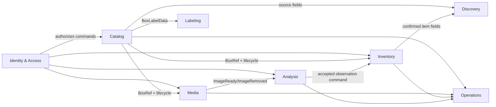
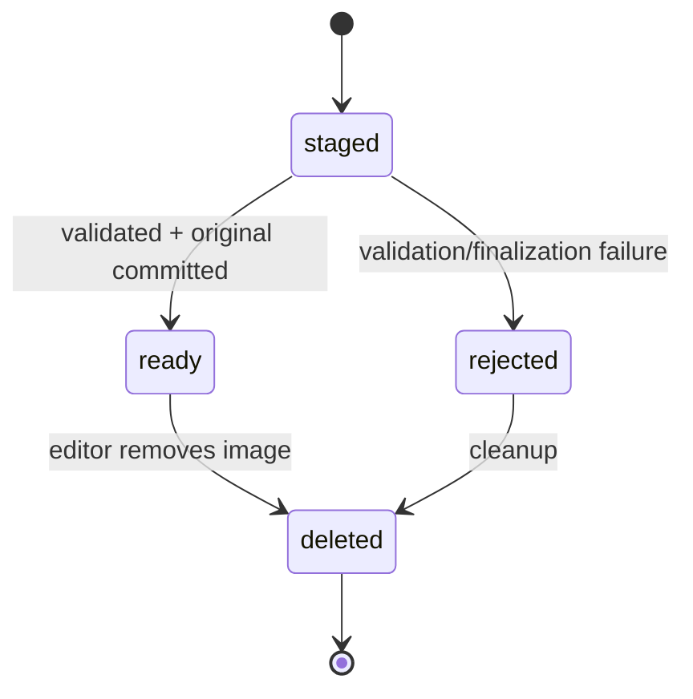
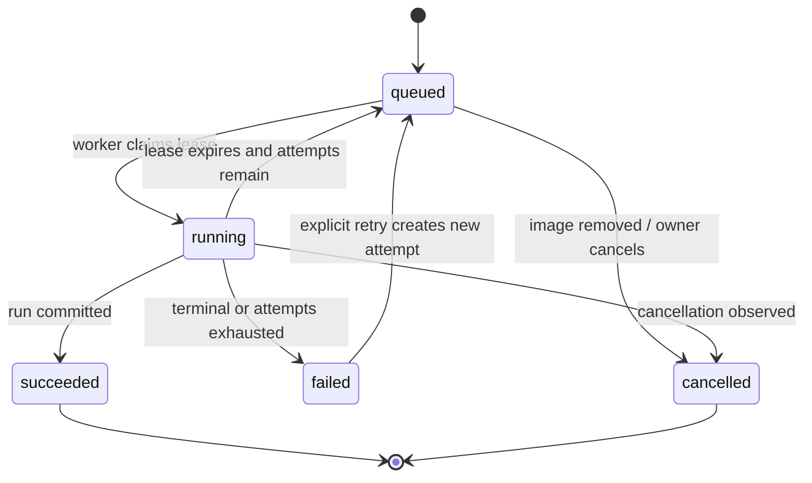
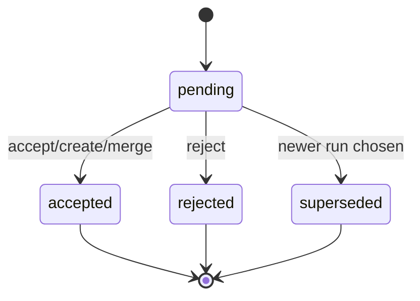

# Domain-Driven Design Specification

## 1. Domain classification

- **Core domain:** trustworthy mapping between a physical box, its stable code, user-confirmed contents, and evidence images.
- **Supporting subdomains:** local AI observation, search projection, QR/label rendering, media processing.
- **Generic subdomains:** local identity, sessions, auditing, backup, health, and configuration.

Boxen is not event-sourced. Aggregates are stored as current state. Domain events coordinate modules inside one unit of work and produce audit/projection effects.

## 2. Bounded contexts

| Context | Owns | Does not own |
| --- | --- | --- |
| Identity and Access | Users, roles, password credentials, sessions | Box permissions beyond role policy |
| Catalog | Box identity, name, Markdown description, lifecycle, code | Image bytes, inventory, AI output |
| Media | Image metadata, lifecycle, ordering, storage keys, derivatives | Box text or AI semantics |
| Inventory | Human-confirmed contents and item history | Raw AI proposals |
| Analysis | Durable requests, immutable runs, observations, review decisions | Confirmed inventory authority |
| Discovery | FTS search document and code/payload resolution | Source-of-truth catalog changes |
| Labeling | QR payload, label profile, deterministic PDF rendering | Printer transport |
| Operations | Health, audit, backup records, integrity/repair jobs | User-facing catalog semantics |

## 3. Context map



References across contexts use immutable IDs and snapshot DTOs, not another context's ORM entity.

## 4. Aggregate specifications

### 4.1 `UserAccount` aggregate

**Identity:** `UserId` (UUIDv7)  
**State:** username, display name, role, password hash, active/disabled status, credential version, created/updated timestamps.

**Invariants**

1. Username is unique under Unicode case-folding and contains 3-64 allowed characters.
2. Role is exactly `owner`, `editor`, or `viewer`.
3. At least one active owner MUST exist.
4. An owner cannot disable or demote the last active owner.
5. Password hashes contain algorithm and cost parameters; plaintext is never stored.
6. Password change increments `credential_version` and invalidates all prior sessions.

**Commands:** `CreateUser`, `ChangeDisplayName`, `ChangeRole`, `DisableUser`, `EnableUser`, `ChangePassword`.  
**Events:** `UserCreated`, `UserDisplayNameChanged`, `UserRoleChanged`, `UserDisabled`, `UserEnabled`, `CredentialChanged`.

### 4.2 `Box` aggregate

**Identity:** `BoxId` (UUIDv7 internal)  
**Public identity:** `BoxCode`  
**State:** name, Markdown description, derived plain text, lifecycle, optimistic version, timestamps.

**Invariants**

1. `BoxCode` is assigned once and never changes or returns to the allocation pool.
2. Name is 1-120 Unicode scalar values after trimming and contains no control characters.
3. Description source is at most 65,536 UTF-8 bytes.
4. Description plain text is produced by the versioned Markdown renderer; clients cannot set it directly.
5. Lifecycle is `active` or `archived`.
6. Archived boxes reject all mutations except restore and owner-authorized purge.
7. Every successful mutation increments aggregate version by exactly one.
8. Purge requires archived state, exact code re-entry, owner role, a recent verified backup, and no running image/analysis jobs.

**Commands:** `CreateBox`, `RenameBox`, `ChangeBoxDescription`, `ArchiveBox`, `RestoreBox`, `PurgeBox`.  
**Events:** `BoxCreated`, `BoxRenamed`, `BoxDescriptionChanged`, `BoxArchived`, `BoxRestored`, `BoxPurged`.

### 4.3 `ImageAsset` aggregate

**Identity:** `ImageId` (UUIDv7)  
**Parent reference:** immutable `BoxId`  
**State:** lifecycle, original metadata/storage key, derivative keys, checksum, caption, ordinal, timestamps.

**Lifecycle**



**Invariants**

1. An image belongs to exactly one box and cannot be moved between boxes.
2. The owning box MUST be active for attach, caption, reorder, remove, or analyze commands.
3. Original checksum, dimensions, media type, byte size, and storage key become immutable at `ready`.
4. Accepted types are JPEG, PNG, and WebP after signature-based detection; extension and request content type are advisory only.
5. Compressed size is at most the configured limit (default 25 MiB) and decoded pixels at most 50 megapixels.
6. Ordinals are unique per non-deleted box image after transaction completion.
7. Deletion first commits logical state; physical deletion is idempotent post-commit cleanup.

**Commands:** `StageImage`, `FinalizeImage`, `RejectImage`, `ChangeImageCaption`, `ReorderImages`, `RemoveImage`.  
**Events:** `ImageStaged`, `ImageReady`, `ImageRejected`, `ImageCaptionChanged`, `ImagesReordered`, `ImageRemoved`.

### 4.4 `InventoryItem` aggregate

**Identity:** `InventoryItemId` (UUIDv7)  
**Parent reference:** immutable `BoxId`  
**State:** display name, normalized name, optional quantity/unit, Markdown notes and plain text, provenance, lifecycle, optimistic version.

AI proposals are not inventory items. Only user commands create or modify this aggregate.

**Invariants**

1. Owning box MUST be active for create/update/merge/remove.
2. Display name is 1-160 Unicode scalar values after trimming and contains no control characters.
3. Quantity, when supplied, is greater than zero, has at most three fractional digits, and is at most `999999.999`.
4. Unit is absent or a 1-24 character display string; v1 does not perform unit conversion.
5. Notes source is at most 16,384 UTF-8 bytes and plain text is server-derived.
6. Lifecycle is `active` or `removed`; removed items are excluded from ordinary reads/search.
7. Provenance is `manual`, `ai`, or `mixed`. User edits to an AI-created item change provenance to `mixed` without losing observation links.
8. Merge has one surviving item, moves observation links, combines quantity only when units are exactly equal, and otherwise requires the editor to supply the result.

**Commands:** `CreateInventoryItem`, `UpdateInventoryItem`, `MergeInventoryItems`, `RemoveInventoryItem`, `RestoreInventoryItem`.  
**Events:** `InventoryItemCreated`, `InventoryItemUpdated`, `InventoryItemsMerged`, `InventoryItemRemoved`, `InventoryItemRestored`.

### 4.5 `AnalysisJob` aggregate

**Identity:** `JobId` (UUIDv7)  
**Operation key:** unique tuple of image ID, requested model profile, prompt version, and client idempotency key.



**Invariants**

1. At most one non-terminal job exists for an operation key.
2. Only a `ready`, non-deleted image on an active box is eligible.
3. A worker may mutate `running` state only while holding the unexpired lease token.
4. Lease expiry permits redelivery; handlers MUST be idempotent.
5. Attempt count never decreases and cannot exceed configured maximum without explicit retry.
6. Succeeded job references exactly one successful `AnalysisRun`.

**Commands:** `RequestAnalysis`, `ClaimJob`, `RenewLease`, `CompleteJob`, `FailAttempt`, `CancelJob`, `RetryJob`.  
**Events:** `AnalysisQueued`, `AnalysisStarted`, `AnalysisSucceeded`, `AnalysisAttemptFailed`, `AnalysisFailed`, `AnalysisCancelled`.

### 4.6 `AnalysisRun` aggregate

**Identity:** `AnalysisRunId` (UUIDv7)  
**State:** immutable input identity, model/projection checksums, prompt/schema versions, runtime parameters, timestamps, status, raw validated output, metrics, observations.

**Invariants**

1. A run references one image version/checksum and one job attempt.
2. Input/provenance fields are immutable after creation.
3. A succeeded run contains JSON that passed the exact pinned output schema and application semantic validation.
4. A failed run contains a bounded error code and safe summary, never arbitrary stack traces in user-visible fields.
5. Run output never mutates confirmed inventory.

**Events:** `AnalysisRunRecorded`, `ObservationsProposed`.

### 4.7 `Observation` entity within `AnalysisRun`

**Identity:** `ObservationId` (UUIDv7)  
**State:** proposed label/quantity/unit/attributes/confidence/bounding box; decision; optional accepted item link; decision actor/time.



**Invariants**

1. Only `pending` observations may be decided.
2. Acceptance and rejection are idempotent for the same requested outcome.
3. Accepted observations reference one active inventory item in the same box.
4. Rejected/superseded observations never appear in confirmed inventory or ordinary search.
5. A later run creates new observations; it does not reset prior decisions.

**Commands:** `AcceptObservationAsNewItem`, `AcceptObservationIntoItem`, `RejectObservation`, `SupersedePendingObservations`.  
**Events:** `ObservationAccepted`, `ObservationRejected`, `ObservationSuperseded`.

### 4.8 `LabelProfile` aggregate

**Identity:** stable profile key such as `sheet-4x2-in`  
**State:** physical dimensions, margins, QR allocation, font sizes, orientation, active status, version.

Built-in profiles are release-controlled. Owner-created profiles are deferred. Label generation is a pure application query from `BoxLabelData + LabelProfile + RendererVersion` and produces deterministic bytes for the same inputs.

## 5. Value objects

### `BoxCode`

- Canonical format: `BX-XXXX-XXXX`.
- Alphabet, in value order, is `0123456789ABCDEFGHJKMNPQRSTVWXYZ` (32 Crockford symbols without `I`, `L`, `O`, or `U`).
- Generate 35 bits from the operating-system CSPRNG and encode them big-endian as exactly seven alphabet symbols.
- Compute `SHA-256(ASCII("BOXEN-BOX-CODE-V1:" + payload7))`; the eighth/check symbol is `alphabet[digest[0] & 31]`.
- Normative test vector: payload `7K3MR9Q` produces check symbol `A`, canonical code `BX-7K3M-R9QA`, and QR payload `boxen:v1:BX-7K3M-R9QA`.
- Canonical display inserts a hyphen after the `BX` prefix and after four symbols: `BX-XXXX-XXXX`.
- Parsing ignores ASCII hyphens/spaces and case, maps `O→0` and `I/L→1`, validates prefix/length/checksum, then returns canonical form. No other Unicode confusable mapping is accepted.
- A checksum collision is possible with probability 1/32 for an arbitrary altered payload; it is typo detection, not authentication. Existence/authorization always comes from the server.
- Persistence uses canonical text with case-insensitive uniqueness.

### `QrPayload`

- Canonical UTF-8 string: `boxen:v1:<canonical-box-code>`.
- Maximum v1 payload length: 64 bytes.
- Decoder also accepts an exact configured local URL form only as an input compatibility alias; generated labels always use the host-independent canonical form.

### `MarkdownDocument`

Contains source, renderer version, rendered sanitized HTML, and search plain text. Raw HTML is disabled. URL schemes are limited to `https`, `http`, and relative links; rendered remote resources are blocked by CSP and external image syntax is stripped.

### `ContentHash`

Lowercase 64-character SHA-256 hex. It identifies exact bytes, not semantic image equality.

### `Quantity`

Decimal numeric plus optional display unit. Equality for merge requires exact numeric/unit semantics; v1 has no conversion registry.

### `AggregateVersion`

Positive integer used in ETags: `"<resource-type>:<public-id>:v<version>"`. Any stale mutation fails with `412 Precondition Failed`.

## 6. Domain services

| Service | Responsibility |
| --- | --- |
| `BoxCodeAllocator` | Generate and reserve collision-safe codes |
| `MarkdownRenderer` | Produce sanitized HTML and plain text with a recorded renderer version |
| `InventoryMergePolicy` | Validate/construct deterministic merge results |
| `ObservationAcceptanceService` | Atomically decide observation and create/merge confirmed item |
| `SearchDocumentAssembler` | Build one canonical search document from catalog/inventory state |
| `QrPayloadCodec` | Encode/decode/version/checksum box payloads |
| `LabelRenderer` | Produce deterministic label preview/PDF bytes |
| `MediaPolicy` | Validate media signature, size, dimensions, and safe derivative parameters |
| `BackupConsistencyService` | Coordinate snapshot, media manifest, and verification |

## 7. Application commands and authorization

| Command group | Viewer | Editor | Owner |
| --- | ---: | ---: | ---: |
| Read/search/scan/download image | Yes | Yes | Yes |
| Create/edit/archive/restore box | No | Yes | Yes |
| Upload/edit/remove image | No | Yes | Yes |
| Manage inventory/review AI | No | Yes | Yes |
| Generate/print label | No | Yes | Yes |
| Create/disable users/change roles | No | No | Yes |
| Backup/integrity/search repair | No | No | Yes |
| Restore/purge | No | No | Yes + step-up confirmation |

Authorization is checked in the application service before loading mutable aggregate state and rechecked for resource lifecycle invariants inside the domain.

## 8. Queries/read models

Queries return immutable DTOs and do not expose domain/ORM entities:

- `GetCurrentUser`
- `ListBoxes`
- `GetBoxDetail`
- `ListBoxImages`
- `ListInventoryItems`
- `ListPendingObservations`
- `GetAnalysisJob`
- `GetAnalysisRun`
- `SearchBoxes`
- `ResolveBoxPayload`
- `GetSystemHealth`
- `ListBackups`

Box detail is a composed read model. It MAY be assembled with optimized SQL joins, provided source authority and authorization are unchanged.

## 9. Repository and port interfaces

Application code depends on these conceptual ports:

```text
UnitOfWork
  boxes: BoxRepository
  images: ImageRepository
  items: InventoryRepository
  analysis_jobs: AnalysisJobRepository
  analysis_runs: AnalysisRunRepository
  users: UserRepository
  audit: AuditRepository
  search: SearchProjectionRepository
  commit() / rollback()

ObjectStore
  stage(stream) -> StagedObject
  commit(staged, content_hash, extension) -> StorageKey
  open(StorageKey) -> stream
  delete(StorageKey) -> idempotent result
  exists_and_hash(StorageKey) -> integrity result

VisionModelPort
  readiness() -> ModelReadiness
  analyze(AnalysisInput, OutputSchema) -> RawModelResult

Clock / IdGenerator / PasswordHasher / LabelRendererPort / QrDecoderPort
```

Repositories save complete aggregate changes inside the caller's transaction. They do not commit independently.

## 10. Error taxonomy

| Domain code | Meaning | HTTP mapping |
| --- | --- | --- |
| `box.not_found` | No visible box for code | `404` |
| `box.archived` | Mutation requires active box | `409` |
| `box.version_conflict` | Stale aggregate version | `412` |
| `box.code_invalid` | Invalid syntax/checksum | `422` |
| `image.invalid` | Type/size/dimension policy failed | `422` |
| `image.not_ready` | Operation requires ready image | `409` |
| `analysis.unavailable` | Configured model/worker unavailable | `503` |
| `analysis.already_pending` | Equivalent job exists | `409` with existing job link |
| `observation.already_decided` | Conflicting second decision | `409` |
| `item.merge_conflict` | Merge requires explicit result | `409` |
| `auth.forbidden` | Role does not authorize action | `403` |
| `resource.precondition_required` | Mutation omitted `If-Match` | `428` |

HTTP adapters serialize these as the Problem Details contract; domain code never depends on HTTP.

## 11. Domain event handling

- Events are collected by aggregates during a command.
- Synchronous handlers run in deterministic order inside the same unit of work for search projection and audit effects that require read-after-write behavior.
- External publication does not exist in v1.
- Background work is represented explicitly by durable job rows, not fire-and-forget event handlers.
- Handler idempotency is enforced with event/operation keys where a retry can occur.
- Audit entries capture actor, action, target type/public identifier, timestamp, request ID, and bounded before/after metadata; they never store passwords, session tokens, image bytes, or full descriptions.

## 12. Package boundary

```text
backend/boxen/
├── identity/{domain,application,infrastructure}
├── catalog/{domain,application,infrastructure}
├── media/{domain,application,infrastructure}
├── inventory/{domain,application,infrastructure}
├── analysis/{domain,application,infrastructure}
├── discovery/{application,infrastructure}
├── labeling/{domain,application,infrastructure}
├── operations/{application,infrastructure}
├── api/                 # HTTP adapters only
├── worker/              # Job adapters only
└── shared/              # IDs, clock, result/error primitives only
```

`shared` MUST remain small and contains no business entity, repository, or catch-all utility module.
