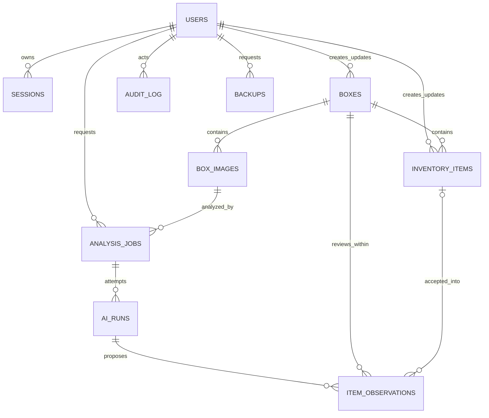

# Data and Storage Specification

## 1. Authority model

Boxen has two coordinated authoritative stores:

1. **SQLite** is authoritative for all structured state, identity, relationships, lifecycle, AI provenance, jobs, search source fields, configuration metadata, audit, and backup records.
2. **Managed local media** is authoritative for original image bytes. SQLite stores the exact content hash and relative storage key for every managed file.

Generated image derivatives, rendered Markdown HTML, FTS rows, labels, and health summaries are replaceable projections/caches. Model files are installation artifacts, not user data.

The reference schema is [contracts/schema.sql](contracts/schema.sql).

## 2. SQLite runtime settings

Every application connection MUST apply and verify:

```sql
PRAGMA foreign_keys = ON;
PRAGMA journal_mode = WAL;
PRAGMA synchronous = FULL;
PRAGMA busy_timeout = 5000;
PRAGMA temp_store = MEMORY;
```

- The application uses one connection pool per process with a small fixed maximum.
- Web reads use deferred transactions. Mutations use `BEGIN IMMEDIATE` to fail/bound contention before domain work.
- Worker claims are short transactions; inference never holds a database transaction open.
- WAL checkpoints are monitored and performed through SQLite APIs, never by deleting `-wal`/`-shm` files.
- The database MUST reside on local storage with locking semantics supported by SQLite.

## 3. Identifier and scalar storage

| Domain type | Storage representation |
| --- | --- |
| UUIDv7 identifiers | Canonical lowercase UUID text |
| `BoxCode` | Canonical uppercase `BX-XXXX-XXXX`, `COLLATE NOCASE` unique |
| Time | UTC RFC 3339 text with microseconds and `Z` |
| Decimal quantity | Integer thousandths in `quantity_milli` |
| Boolean | Integer `0` or `1` |
| Hash | Lowercase SHA-256 hex |
| Enum | Lowercase constrained text |
| JSON | Canonical UTF-8 JSON text with `json_valid` checks |
| Aggregate version | Positive integer |

API serializers convert quantity thousandths to/from a decimal JSON string so binary floating point never becomes authoritative.

## 4. Table ownership

| Table | Owning context | Mutability |
| --- | --- | --- |
| `users`, `sessions`, `idempotency_records` | Identity/API boundary | Mutable lifecycle/session/replay state |
| `boxes` | Catalog | Versioned mutable aggregate state |
| `box_images` | Media | Versioned lifecycle/metadata |
| `inventory_items` | Inventory | Versioned lifecycle/content |
| `analysis_jobs` | Analysis | State machine and lease mutations |
| `ai_runs` | Analysis | Insert-only immutable run record |
| `item_observations` | Analysis | Proposal immutable; decision fields transition once |
| `label_profiles` | Labeling | Release-seeded/configuration state |
| `box_search` | Discovery | Rebuildable projection |
| `search_projection_state` | Discovery | Projection version/integrity metadata |
| `audit_log` | Operations | Append-only |
| `backups` | Operations | Backup state/verification metadata |
| `maintenance_jobs` | Operations | Durable maintenance state/lease/progress |
| `app_settings`, `schema_migrations` | Platform | Controlled configuration/migration state |

## 4.1 Logical relationship model



`box_search` is a denormalized projection keyed by `BoxId`, not an aggregate relationship. Audit and code tombstones intentionally survive source-object purge according to retention policy.

## 5. Transaction boundaries

### Box mutation

One transaction loads the versioned box, checks invariants, writes the aggregate, rebuilds its search row, appends audit, and commits. The response is returned only after commit and includes the new ETag.

### Inventory mutation / observation acceptance

One transaction:

1. validates actor and active box;
2. loads observation and/or item versions;
3. transitions observation decision when applicable;
4. creates/updates/merges inventory;
5. relinks prior accepted observations when merging;
6. rebuilds the box search row;
7. appends audit;
8. commits.

There is no window in which accepted AI content is visible without its inventory item or vice versa.

### Image upload

The binary cannot be committed atomically with SQLite, so upload uses a recoverable saga:

1. Stream request to random `media/staging/*.part` while enforcing byte limit and calculating SHA-256.
2. Decode under pixel/resource limits; validate signature and metadata; normalize orientation into derivatives.
3. Insert `staged` image metadata with the expected hash in a short transaction.
4. Atomically rename the original and derivatives into final storage keys on the same filesystem.
5. Transition image to `ready`, write audit, and commit.
6. If step 4 or 5 fails, mark/reconcile as `rejected`; a sweeper removes unreferenced staging/final files.

The API reports success only for `ready`. Duplicate upload to the same box returns the existing image when the hash matches an active image.

### Image removal

The transaction marks the image `deleted`, cancels pending jobs, supersedes pending observations, reorders remaining images, and writes audit. After commit, idempotent cleanup removes derivatives and removes the original only when no non-deleted row references its storage key.

### AI completion

Inference occurs outside a transaction. Completion opens one transaction, verifies job lease and image checksum, inserts the immutable run and observations, moves the job to terminal state, and commits. A uniqueness key prevents duplicate terminal runs for one job attempt.

## 6. Media storage

### Original policy

- Preserve accepted original bytes for evidentiary value and future re-analysis.
- Compute hash while streaming before finalization.
- Ignore user path and filename for storage; retain a sanitized filename only as display metadata.
- Store original extension derived from detected media type.
- Do not serve originals inline by default; serve the display derivative.

### Derivatives

| Derivative | Bounding box | Format | Purpose |
| --- | --- | --- | --- |
| Thumbnail | 480 × 480 | WebP | Lists/search/review queue |
| Display | 2048 × 2048 | WebP | Box gallery and AI input default |

Derivatives preserve aspect ratio, never upscale, apply EXIF orientation, strip metadata, and record the renderer version. AI may use the original only when the selected model profile requires additional detail and policy allows it.

### Storage key

```text
<kind>/<sha256[0:2]>/<sha256[2:4]>/<sha256>.<ext>
```

Files are written to a temporary sibling, flushed, then atomically renamed. Directory and file permissions default to owner-only service access.

## 7. Search projection

`box_search` contains one row per non-purged box:

- unindexed `box_id`;
- `code`;
- `name`;
- `description` plain text;
- concatenated active confirmed item names;
- concatenated active confirmed item notes.

### Update rule

`SearchDocumentAssembler` deterministically rebuilds the entire box row inside the source mutation transaction. It never performs incremental string surgery. This gives read-after-write consistency and avoids drift from merge/remove operations.

### Query rule

1. Normalize and validate a possible box code; exact code hit is returned first.
2. Escape user input into an application-generated FTS5 query; raw FTS syntax is not accepted from the browser.
3. Use BM25 with fixed weights: code `12`, name `8`, item names `6`, description `2`, item notes `1`.
4. Return bounded highlighted snippets produced by FTS and sanitized as text, not trusted HTML.
5. Exclude archived boxes by default; owner/viewer filter may include them.

### Verification and rebuild

- A verify command recomputes canonical documents and compares row hashes.
- A rebuild creates a replacement FTS table in one maintenance transaction and swaps it after success.
- Search unavailability never prevents exact direct catalog reads.

## 8. Concurrency

- Every mutable aggregate table has `version`.
- GET returns an ETag derived from stable public identity and version.
- PATCH/DELETE/state-transition requests MUST include `If-Match`; missing yields `428`, stale yields `412` with current ETag.
- Create and job-request endpoints accept `Idempotency-Key`; key + actor + route + canonical request hash is unique for 24 hours.
- Database busy retries use bounded jitter for at most the configured 5-second busy window.
- The UI must never silently retry a non-idempotent mutation without an idempotency key.

## 9. Migration policy

1. Migration files are immutable and named with a monotonic numeric revision.
2. `schema_migrations` records revision, checksum, and completion time.
3. Startup takes an application-level migration lock.
4. Before a migration marked `backup_required`, startup requires a verified pre-upgrade backup.
5. Schema/data migration is forward-only. Rollback means restoring the pre-upgrade backup with the prior application version.
6. A migration is restart-safe: either transactional, or split into explicitly journaled resumable steps.
7. The application refuses to start on unknown newer schema or checksum mismatch.

## 10. Backup format

A backup is a directory or archive containing:

```text
backup-<UTC>-<id>/
├── manifest.json
├── boxen.sqlite3
├── media/originals/...
├── configuration/public-settings.json
└── checksums.sha256
```

`manifest.json` includes backup format version, application/schema version, creation time, source installation ID, database integrity result, file count/bytes, model profile identifiers (not model files), and checksum-list hash.

### Creation

1. Check disk reserve and acquire backup coordinator lock.
2. Use SQLite Online Backup API to create a consistent snapshot.
3. Run `PRAGMA integrity_check` on the snapshot.
4. Copy every original referenced by the snapshot; derivatives are optional/rebuildable.
5. Write checksums and manifest last using atomic rename.
6. Verify a sample plus all manifest/database checksums; mark backup verified.

### Restore

Restore is offline. It validates format compatibility, every checksum, database integrity, referenced-media completeness, available disk, and destination ownership. Existing data is moved to a recoverable quarantine path before atomic activation. Post-restore runs migrations only after the restored version boots successfully and then rebuilds derivatives/search as needed.

## 11. Retention and purge

- Sessions expire and are physically deleted after retention.
- Idempotency records expire after 24 hours.
- Audit log is retained for the life of the installation unless the owner runs a documented privacy purge.
- AI runs and decisions remain while the box exists; raw successful JSON MAY be pruned after one year only if normalized observations and provenance remain.
- Removed inventory and deleted image metadata remain for 30 days before owner-authorized purge.
- Box purge deletes dependent structured records transactionally, then garbage-collects unreferenced media. Box codes remain in a tombstone registry and are never reused.
- Backup retention default is 14 verified generations; deletion never removes the last verified backup.

## 12. Integrity checks

Health and maintenance commands distinguish:

- `PRAGMA quick_check` daily and `integrity_check` during verified backup/release qualification;
- foreign-key check;
- FTS source/projection hash check;
- missing/orphan media check;
- original SHA-256 sample/full audit;
- derivative renderer-version drift;
- stuck/expired job lease check;
- invalid terminal observation decision check;
- last-owner and active-session credential-version invariants.

Integrity findings are immutable reports and never auto-delete user data.
