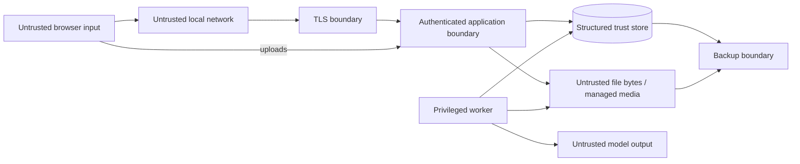

# Security and Privacy Specification

## 1. Security objective

Boxen protects private household/workshop inventory, images, local credentials, and backups on a single local host. “Local” does not mean trusted: the LAN, browser inputs, uploaded files, QR payloads, model output, and non-owner users are untrusted.

The release target is the applicable subset of OWASP ASVS 5.0 Level 2, plus the explicit controls below. Internet-facing deployment is unsupported and outside the threat model.

## 2. Protected assets

1. Box names, Markdown descriptions, inventory, and search data.
2. Original images and derivatives.
3. Password hashes, sessions, CSRF secrets, and signing keys.
4. Audit records and authorization policy.
5. Database/media integrity and backups.
6. Model/profile integrity and AI provenance.
7. Local CA private key and trusted origin identity.
8. Host resource availability; AI/image workloads must not exhaust the system.

## 3. Trust boundaries



- The proxy trusts only its local configuration/CA store.
- The web process trusts authenticated/authorized application state, not browser claims.
- The database is authoritative but data read from it is still escaped for its output context.
- The worker has greater file/model access than the web process and therefore a smaller network/filesystem surface.
- AI output is always untrusted text/JSON.

## 4. Threat model

| Threat | Example | Required controls |
| --- | --- | --- |
| LAN interception/impersonation | Attacker reads inventory or steals session | Local HTTPS, trusted CA onboarding, Secure cookies, no HTTP application mode on LAN |
| Credential attack | Guessing local owner password | Argon2id, rate limits, generic failure, session rotation, audit |
| CSRF | Malicious local/public page mutates Boxen | SameSite Strict, CSRF header, exact Origin check, no permissive CORS |
| XSS/Markdown injection | Description embeds script/remote image | Raw HTML disabled, sanitizer, CSP, contextual escaping, regression corpus |
| SQL/FTS injection | Search payload changes query semantics | Parameterized SQL, application-built FTS query, no raw syntax |
| Malicious upload | Polyglot/decompression bomb/path name | Signature decode, byte/pixel limits, generated paths, metadata strip, sandbox/resource limits |
| Malicious QR | URL/script/oversized payload | Length cap, strict parser/version/checksum, no direct navigation to decoded URL |
| Prompt injection in image | Printed text tells model to access files | Text treated as data, no tools/network, constrained output, least filesystem access |
| Model output injection | Model returns markup/path/commands | JSON/schema/semantic validation; output is text only; never interpreted |
| Authorization bypass | Viewer edits box via direct API | Central role policy, application checks, route matrix tests, deny by default |
| Stale-write/data loss | Two editors overwrite | Mandatory ETag/If-Match and conflict UI |
| Resource exhaustion | Huge image, job flood, runaway model | Upload/decoded limits, queue cap, slots, timeout, disk reserve, rate limits |
| Supply-chain compromise | Changed image/model/dependency | Locks/digests/checksums, SBOM, offline artifact verification, no runtime install |
| Backup disclosure/tamper | Copied backup read or modified | Restrictive permissions, checksums/manifest, encrypted host storage recommendation, restore verification |
| Local host compromise | Root reads all data | Explicit residual risk; OS accounts, full-disk encryption, patching, restricted service user |

## 5. Identity and credential controls

### Passwords

- Minimum 12 characters; maximum accepted length 1024 bytes; allow spaces and Unicode.
- No arbitrary composition rules or forced periodic changes.
- Check only against a locally bundled common-password blocklist; no remote breach service.
- Hash with Argon2id using a 16-byte random salt and 32-byte tag.
- Minimum parameters are RFC 9106's constrained-memory recommendation: 64 MiB, 3 iterations, parallelism 4. At setup, benchmark and MAY increase memory/time while keeping interactive login within the configured 250-750 ms target on the host.
- Store encoded algorithm/version/parameters/salt/hash. Rehash after successful login when policy increases.
- Password change requires current password for self-service or owner authorization for administrative reset, increments credential version, and revokes sessions.

### First-owner enrollment

- On initial install, a 256-bit one-time setup token is generated into a restricted local file and printed once to the host console.
- `POST /setup/owner` requires that token in `X-Boxen-Setup-Token`, exact configured Origin, HTTPS, and an empty users table.
- Only a token hash is compared; success atomically creates the owner, deletes/invalidates setup material, closes setup routes, and starts a rotated normal session.
- Setup attempts are rate-limited and audited without logging the token.
- Reopening setup requires an explicit local CLI recovery procedure with physical/OS access; it cannot be triggered through the web API.

### Sessions

- Generate at least 256 bits from the operating-system CSPRNG.
- Store only SHA-256 token hash; compare in constant time.
- Cookie: `Secure; HttpOnly; SameSite=Strict; Path=/`.
- Rotate on login, password/role change, and first privilege elevation.
- Default 12-hour idle and 7-day absolute expiry.
- Logout/revoke is server-side and immediate.
- A role or credential-version mismatch invalidates the session.
- Login pages and authenticated API responses use `Cache-Control: no-store`.

### Authorization

- Role policy is centralized and unit/contract tested for every operation.
- Owner-only mutations require recent authentication (within 15 minutes) for user-role changes, purge, and backup deletion/restore preparation.
- Last active owner cannot be disabled/demoted.
- Object identifiers never confer permission.
- The web process does not trust role/capability data sent by the frontend.

## 6. Browser and transport controls

### TLS

- The supported LAN origin is HTTPS only.
- Caddy internal CA files persist with service-only permissions.
- Owners explicitly install/trust the root on each client device; fingerprints are displayed out of band in setup docs.
- HTTP, when enabled, redirects only and never serves login/application content.
- AI and upstream app ports are private/loopback and not published.

### Required response headers

```text
Content-Security-Policy:
  default-src 'self';
  script-src 'self';
  style-src 'self';
  img-src 'self' data: blob:;
  media-src 'self' blob:;
  connect-src 'self';
  font-src 'self';
  worker-src 'self' blob:;
  object-src 'none';
  base-uri 'none';
  frame-ancestors 'none';
  form-action 'self'
Referrer-Policy: no-referrer
X-Content-Type-Options: nosniff
X-Frame-Options: DENY
Permissions-Policy: camera=(self), microphone=(), geolocation=(), payment=(), usb=()
Cross-Origin-Opener-Policy: same-origin
Cross-Origin-Resource-Policy: same-origin
```

HSTS MAY be enabled for a stable trusted local hostname after device trust is established; rollout must not strand recovery/setup access.

### CORS and CSRF

- No CORS headers are emitted in production.
- State changes require valid session, CSRF token, and exact allowed Origin.
- GET/HEAD are side-effect free.
- Login is protected by strict content type, Origin, and rate limits even before a session exists.

## 7. Input/output safety

### General

- Schema validation occurs at the HTTP boundary; domain validation occurs again on commands.
- JSON request bodies reject duplicate keys, invalid UTF-8, non-finite numbers, unknown properties, and excessive depth/size.
- SQL uses bound parameters; identifiers/order expressions are allowlisted code paths.
- Logs use structured fields and never concatenate untrusted text into format strings.
- CSV/export is deferred; no spreadsheet formula concerns in v1.

### Markdown

- Raw HTML disabled at parser level.
- Sanitizer allowlist covers headings, paragraphs, emphasis, code, blockquotes, lists, tables, and safe links.
- External images/embeds are removed. Links receive safe attributes and are not fetched by Boxen.
- Rendered HTML is regenerated by server version and protected by CSP.
- Markdown and sanitization corpus includes stored/reflected DOM XSS payloads, malformed Unicode, URL scheme abuse, and parser differential cases.

### Images

- Stream to staging with byte limit; never trust filename or request MIME.
- Identify by decoded signature through a maintained library.
- Set strict pixel, dimension, frame, metadata, decode-time, and memory limits.
- Reject animated/multi-frame content for v1 even when container type is otherwise supported.
- Re-encode derivatives, stripping metadata; serve with explicit image content type and `nosniff`.
- Original download requires editor/owner because originals may retain metadata.
- Image processing runs in worker with CPU/memory/time limits and no outbound network.

### QR

- Decode client-side but treat result as untrusted input.
- Maximum 512 input characters from scanner/upload and 64 bytes for canonical payload.
- Parse only Boxen scheme/version/code or configured exact local URL alias.
- Never `window.location` to arbitrary decoded content.

### AI

Controls in the AI specification are mandatory: no tools/agents/network, strict schema, output limits, no interpreted output, private bind, checksum pinning, and human review.

## 8. Secrets and filesystem permissions

| Asset | Storage | Required permissions |
| --- | --- | --- |
| Session signing/key material | Restricted secret file | Web service read only |
| Password hashes | SQLite | Web read/write through repository only |
| Caddy CA private keys | Persistent TLS volume | Proxy service only |
| Database | Data volume | Web/worker service account only |
| Originals | Media volume | Web read; worker read/write; no direct proxy mount |
| Models | Model volume | AI read only; provisioning process write |
| Backups | Backup volume | Worker/owner operation only |

- Containers run as non-root fixed UIDs, read-only root filesystems, no-new-privileges, dropped capabilities, and bounded resources where supported.
- Secrets are never baked into images, committed, printed in diagnostics, or exposed through `/system`.
- Configuration errors fail closed.

## 9. Database and audit security

- SQLite foreign keys, strict tables, integrity checks, and transactions are mandatory.
- Application database connection uses only local file access; no SQLite loadable extensions at runtime.
- Audit is append-only at schema and application layers.
- Audit events include actor/action/target/request/time and bounded safe metadata, not full object snapshots.
- Failed login, user/role/session change, purge, backup, restore attempt/result, integrity/repair, and configuration change are audited.
- Ordinary reads/searches are not audited to avoid sensitive access trails unless future policy requires it.

## 10. Privacy

### Data inventory

Boxen stores local usernames/display names, credentials (hashes only), box and inventory text, images (possibly with original metadata), AI derived observations, audit metadata, and operational metrics.

### Privacy principles

- No telemetry or analytics SDK.
- No remote crash reporting, font/CDN load, model API, or external URL preview.
- No background internet update check.
- No training/fine-tuning from user data in v1.
- The system provides an owner-readable inventory of stored data and paths.
- Export/purge behavior is documented; purge cannot erase copies already present in retained backups until those backups expire or are owner-deleted.
- Logs default to 14-day retention and contain identifiers/codes only when necessary, never image/text contents.

### At-rest encryption

Boxen relies on host full-disk/volume encryption for live data in v1. Backups are created with owner-only permissions and integrity protection but are not automatically encrypted by the application. Documentation MUST clearly recommend encrypted destination media and treat removable backups as sensitive. Application-layer encrypted backup is a future capability, not an implicit claim.

## 11. Availability controls

- Reserve disk threshold: reject uploads/AI/backup before exhausting filesystem; keep reads/auth available.
- Queue limit and one-slot default prevent AI flood.
- Database lock waits bounded to 5 seconds.
- Model process has memory/CPU limits and may fail without taking down web.
- Upload and inference timeouts are explicit.
- Backup and integrity tasks are single-flight.
- Health endpoints separate liveness from dependency readiness and expose minimal unauthenticated detail.

## 12. Security verification baseline

The project maintains a versioned ASVS mapping. At minimum release tests cover:

- architecture/threat model and trust boundaries;
- authentication, session, access control, input validation, encoding/sanitization;
- stored/reflected/DOM XSS and CSRF;
- SQL/FTS/command/path injection;
- file upload/decompression/resource exhaustion;
- cryptography/randomness/password storage;
- secure communications and headers;
- error/log/data protection;
- API schema/rate/resource limits;
- configuration, containers, dependencies, SBOM, and secret scanning.

An unresolved critical/high vulnerability blocks release. Medium findings require explicit owner-accepted mitigation and expiry.

## 13. Incident and recovery procedure

If compromise is suspected:

1. Disconnect the host from the LAN; preserve power/state if forensic needs exist.
2. Copy logs/audit and verify backup/media/database hashes without exposing credentials.
3. Rotate session/signing material and local user passwords.
4. Revoke/reissue local CA if key exposure is possible and remove old trust from devices.
5. Restore only from a verified pre-incident backup onto a clean, patched host.
6. Re-verify release images/models/dependencies against trusted offline digests.
7. Document affected data and residual backup copies.
