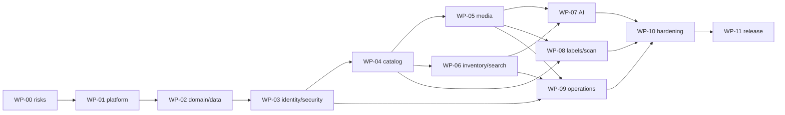

# Delivery Plan

> Scope correction: [ADR-0005](adrs/0005-small-local-app-and-anonymous-access.md) supersedes capacity work packages and the account-required default. Build for single/low-user local use with configurable anonymous access; do not add capacity benchmarking as a delivery gate.

## 1. Delivery principles

- Build vertical, demonstrable slices through UI → API → application/domain → SQLite/filesystem.
- Establish contracts and failure behavior before feature breadth.
- Use the deterministic fake AI runtime for ordinary development; gate real-model work separately.
- Preserve a startable, migration-safe application at every merged work package.
- A phase is complete only when its exit evidence is archived, not when code is merely written.

## 2. Workstreams

| Stream | Scope |
| --- | --- |
| Platform | Repository, builds, dependency locks, containers, config, process supervision |
| Domain/data | Aggregates, repositories, migrations, FTS, jobs, audit |
| API | OpenAPI-first handlers, auth, errors, concurrency, clients |
| UI | Cyberpunk design system, responsive routes, accessibility, camera/review flows |
| AI/media | Upload/derivatives, worker, runtime adapter, model qualification |
| Operations/security | TLS, hardening, backup/restore, health, diagnostics, ASVS |
| Quality | Test harnesses, fixtures, capacity, devices, offline/release evidence |

One owner coordinates cross-stream contract changes; no stream changes a normative contract without updating this dossier and contract tests in the same change.

## 3. Sequenced work packages

### WP-00 — Decision closure and risk proofs

**Entry:** System design accepted for implementation.  
**Outputs:**

- confirm host/hardware, collection capacity, phones, printer/stock, account needs, model provisioning mode;
- ADR review/acceptance;
- validate SQLite FTS5/WAL on target filesystem;
- print/decode canonical QR payload at candidate label sizes;
- prove local HTTPS/camera on target iPhone and Android;
- benchmark at least two candidate model profiles on a 30-image spike subset;
- baseline contrast/layout prototype for cyberpunk tokens at 320/1024 px.

**Exit gate:** No unresolved issue can invalidate storage topology, QR code, TLS/camera, model adapter, or core data model. Measurements replace provisional hardware/label/model assumptions.

### WP-01 — Repository and platform skeleton

**Outputs:**

- backend/frontend workspace, dependency locks, formatting/lint/type checks;
- layered module/package boundaries with architecture tests;
- version/build metadata, config loader, secret-file handling;
- production and development containers, private networks/volumes;
- embedded frontend shell and health endpoints;
- CI tiers and offline static-asset check.

**Verification:** `T-ARCH-001..008`, container smoke, no external asset request.  
**Exit gate:** Clean checkout builds from documented inputs and starts a production-like shell with egress denied.

### WP-02 — SQLite foundation and domain kernel

**Outputs:**

- migration framework and initial schema;
- typed IDs, BoxCode/checksum, clock/random/transaction ports;
- unit of work and repositories;
- catalog/inventory/media/analysis state-machine domain classes;
- audit writer, idempotency record, ETag/version primitives;
- database integration harness and prior-version fixture format.

**Verification:** `T-DOM-*`, `T-DB-001`, `T-DB-004..007`, mutation tests.  
**Exit gate:** Domain invariants cannot be bypassed through repositories and crash/restart retains committed fixture state.

### WP-03 — Local identity and secure application boundary

**Outputs:**

- first-run owner setup, users/roles, Argon2id benchmark/hash;
- sessions, CSRF, Origin checks, authorization policies;
- RFC 9457 errors, request IDs, limits, rate limiting;
- Caddy local CA deployment and device trust runbook;
- baseline CSP/security headers and audit events;
- login/setup/system shell UI.

**Verification:** `T-DOM-IAM-*`, `T-API-003..009`, auth/CSRF security suite, phone HTTPS.  
**Exit gate:** Viewer/editor/owner policy is enforced end-to-end and no application content is served over untrusted LAN HTTP.

### WP-04 — Catalog and Markdown vertical slice

**Outputs:**

- box create/read/update/archive/restore/purge application services and API;
- Markdown parser/sanitizer/plain-text pipeline;
- synchronous search-document assembly foundation;
- Home, Boxes, Create/Edit, Box Detail responsive screens;
- optimistic-conflict UI and draft preservation;
- exact code lookup.

**Verification:** `T-DOM-BOX-*`, `T-MD-*`, relevant `T-API-*`, `T-E2E-002`, `T-E2E-008..010`.  
**Exit gate:** Authorized phone user can catalog/search/archive/restore a Markdown-described box with stale-write protection.

### WP-05 — Media pipeline

**Outputs:**

- streaming staging/finalization saga;
- image validation, checksums, orientation, metadata stripping, derivatives;
- managed storage/reference cleanup and integrity scan;
- image APIs, capture/file chooser, gallery, caption/reorder/remove;
- disk reserve enforcement and media health.

**Verification:** `T-MEDIA-*`, `T-API-010..011`, `T-E2E-003`, saga fault injection.  
**Exit gate:** Target phones upload/capture supported images; every injected interruption yields a reconciled state and no unsafe served bytes.

### WP-06 — Confirmed inventory and search

**Outputs:**

- inventory CRUD/merge/provenance;
- full FTS5 projection/ranking/snippets/filters;
- verify/rebuild maintenance jobs;
- global search UI and matching-item presentation;
- capacity data generator and query-plan baselines.

**Verification:** `T-DOM-ITEM-*`, `T-DB-008..009`, search suite, `T-E2E-005`, performance gates.  
**Exit gate:** Every source mutation is immediately reflected in ranked search at reference capacity and projection can be verified/rebuilt safely.

### WP-07 — Durable AI analysis and review

**Outputs:**

- SQLite job leases/recovery and worker process;
- fake deterministic runtime and adapter contract suite;
- pinned local runtime integration, profile manifest/checksum validation;
- prompt/schema/preprocessing pipeline and immutable provenance;
- observation review UI and atomic accept/edit/merge/reject;
- model-disabled/degraded behavior;
- full candidate profile evaluation.

**Verification:** `T-DOM-AI-*`, `T-DB-010`, AI adapter/evaluation gates, `T-E2E-004`, `T-E2E-011`.  
**Exit gate:** Worker restarts cannot lose/duplicate decisions; qualified profile meets quality/resource thresholds; core product remains healthy without AI.

### WP-08 — Labels and retrieval

**Outputs:**

- QR codec/version/checksum parser;
- built-in physical label profiles, deterministic PDF renderer, preview;
- scanner client with live camera, local image decode, and typed code;
- camera lifecycle/permission/error handling;
- printer/device fixture automation and physical qualification.

**Verification:** QR/parser fuzz, PDF dimensions/decode, `T-E2E-006..007`, full physical label matrix.  
**Exit gate:** Every supported print profile scans on target phones and all three retrieval paths resolve the same box without internet.

### WP-09 — Operations, backup, and maintenance

**Outputs:**

- system status, worker/model/search/media/disk health;
- backup coordinator/manifest/checksums/retention/verification;
- offline restore CLI with quarantine and verification;
- maintenance job persistence/progress;
- structured logs/rotation, local metrics, redacted diagnostics;
- update/migration and disaster-recovery runbooks.

**Verification:** `T-E2E-012..014`, migration matrix, fault injection, newest/oldest backup restore drills.  
**Exit gate:** A second operator can install, back up, upgrade, restore, and diagnose from documentation without source-code knowledge.

### WP-10 — UI/accessibility and security hardening

**Outputs:**

- complete design-token/component application and visual regressions;
- all screen states/responsive breakpoints;
- keyboard/screen-reader/reduced-motion/forced-color fixes;
- ASVS control/evidence matrix, abuse tests, dependency/container hardening;
- performance profiling and capacity remediation;
- privacy/retention/license/user/admin documentation.

**Verification:** full `T-UI-*`, security plan, performance gates, device matrix.  
**Exit gate:** No critical accessibility/security defect; all target layouts/devices pass; cyberpunk styling never obscures function.

### WP-11 — Release qualification

**Outputs:**

- production images, offline release/model bundles, checksums/signature, SBOM/notices;
- full requirements traceability evidence;
- clean-host install and upgrade rehearsals;
- runtime-offline suite with network-attempt capture;
- verified backup/restore and physical label evidence;
- release notes, known limitations, rollback package.

**Verification:** all ten release gates in the quality plan.  
**Exit gate:** Definition of Done below is met with archived evidence.

## 4. Dependency graph

UI design-system work begins in WP-01 and is applied in each vertical slice; WP-10 is consolidation/hardening, not the first UI implementation.

## 5. Change control

A design change requires:

1. an ADR when it changes a fixed decision or meaningful tradeoff;
2. updates to prose and machine-readable contracts in the same change;
3. migration/backward-compatibility assessment;
4. traceability and tests updated before merge;
5. owner approval for scope expansion, new external dependency, new data category, security boundary, or destructive behavior.

## 6. Definition of Done

Boxen v1 is done only when a clean local host can install from verified artifacts, enroll a phone for local HTTPS, operate with public egress denied, create and document boxes, capture/store photos, produce and review local AI observations, curate/search confirmed contents, print/scan labels through all supported paths, enforce local roles, survive process/host restarts, create/verify/restore backups, upgrade from the prior supported schema, and pass security, accessibility, device, physical label, model, performance, and traceability gates.

No requirement may be declared done by mock, design, or unverified manual claim alone.
